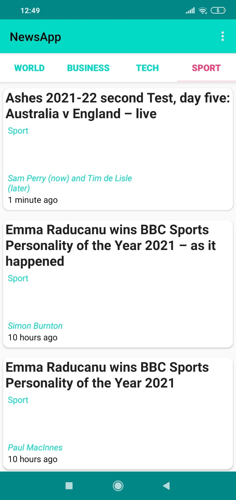

An android application built as the coursework during Android Udacity Nanodegree programme .
This applications shows the latest news related to Technology , Sports , Business & World.

  

This application fetches the news from the Guardian API using Http request and
parses the JSON response to show all the news (world, tech, sports & business) in
the respective fragments.

